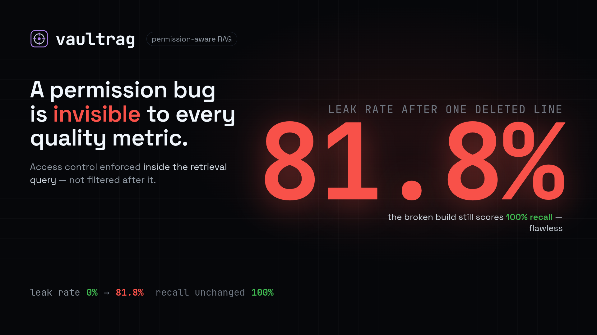

# vaultrag

[](https://github.com/royalpinto007/vaultrag/actions/workflows/ci.yml)
[](LICENSE)
[](tests/)

Permission-aware RAG. **Access control is enforced inside the retrieval query, not after it.**

## Demo

[](assets/demo.mp4)

▶ [Watch the demo](assets/demo.mp4)

```bash
$ vaultrag ask "what is the quarterly bonus payout policy" --user alice
asking as alice, principals: ['user:alice', 'group:engineering']

      retrieved (only what this user may see)
 doc               title                    score
 eng-onboarding    Engineering Onboarding   0.0328
 all-hands         All Hands Notes          0.0161

conflict eng-onboarding vs all-hands: an official and an informal document both answer this
stale old-handbook last updated 2431d ago (owner: None)

The quarterly bonus for engineering is 10% of base salary, paid the month after quarter end.
sources: eng-onboarding

$ vaultrag ask "what is the quarterly bonus payout policy" --user bob
asking as bob, principals: ['user:bob', 'group:sales']
# ...same question, different corpus. bob never sees engineering's answer, and the CEO's
# private note is invisible to both of them.
```

## Why

The usual RAG pipeline is: embed the question, retrieve top-k, filter out what the user is not
allowed to see, generate an answer. That is a leak waiting to happen.

By the time you filter, the unauthorized chunks are already in your process. They can land in a
log line, a trace span, an error report, or a prompt you assembled one step too early. And a
top-k of 5 that filters down to 1 silently degrades the answer with no signal that it happened.

vaultrag puts the ACL predicate in the same SQL query as the vector search and the keyword search.
A chunk the user cannot see is never selected, never scored, never ranked, never logged. It cannot
leak, because it was never fetched.

## Measuring it, not asserting it

"Permissions are enforced at retrieval" is a slogan until there is a number attached. `vaultrag
eval` runs a gold set of (user, question, what-they-should-and-should-not-see) against a real
corpus and reports two metrics that only mean something **together**:

- **leak rate**: did anything the user may not see surface. One leak is a failure, not a
  percentage point. Target: exactly zero.
- **recall**: of the documents they *may* see that answer the question, how many made it back.

The pairing is the whole design, because each is trivial to fake alone. Retrieve nothing and you
score a perfect 0% leak rate. Retrieve everything and you score perfect recall.

```
$ vaultrag eval demo/gold.json --strict
 cases                11
 leak rate            0.0%
 mean recall          100.0%
 pass rate            100.0%
 refusal correctness  not measured (stub LLM)
```

**Delete the ACL predicate and re-run:**

```
$ vaultrag diff before.json after.json
LEAK
  leak rate: 0.0% -> 81.8%
  mean recall: 100.0% -> 100.0%
```

Read that second line. **Recall did not move.** The broken build answers every question correctly
and completely, while handing alice the CEO's private notes and HR's salary bands. A quality-only
eval scores that build perfect. This is why leak rate is never reported on its own, and why CI
fails on `--strict` rather than on a threshold.

Refusal correctness is deliberately reported as *not measured* under the stub LLM. Whether the
model declines when it has no evidence is a property of the model, and scoring a stub on it would
launder a fake into a metric. CI runs the two metrics it can actually prove.

### Two bugs this found in its own repo

The harness earned its keep before it was even committed:

1. **The refusal threshold was unreachable.** `weak_evidence` refused anything scoring under 0.02.
   With RRF at k=60, a chunk found by a single arm scores at most 1/61 = 0.0164, which is *below
   the floor*. Every document only one arm found was refused no matter how perfectly it ranked. The
   threshold is now derived from the RRF constant rather than picked by hand.

2. **The test suite deleted the demo corpus.** `conftest.py` reset the schema of whatever
   `DATABASE_URL` pointed at, which is the database you have exported. The eval then reported
   **0% leaks and a 100% pass rate against an empty corpus.** The most convincing wrong answer the
   tool can produce is the one that says everything is fine. `test_empty_corpus_does_not_score_green`
   now pins it, and the tests choose their own database.

## The proof

Every document in the test corpus contains the phrase *"quarterly bonus payout policy"*. A
retriever without access control would happily hand the CEO's private notes to anyone who asks
about bonuses. The only thing preventing that is the ACL predicate.

`tests/test_acl.py` asserts it, 12 ways:

```
test_group_isolation_alice_cannot_see_sales_or_hr
test_group_isolation_bob_cannot_see_engineering_or_hr
test_multi_group_user_sees_union_not_everything
test_nobody_sees_the_ceo_document
test_empty_acl_is_deny_by_default
test_user_level_grant_works_without_any_group
test_shared_document_reaches_every_permitted_group
test_revoking_acl_takes_effect_immediately
test_removing_user_from_group_takes_effect_immediately
test_soft_deleted_document_is_unreachable
test_unknown_user_resolves_to_nothing
test_groups_are_not_taken_from_the_caller
```

These tests run against a real Postgres, not a mock. Mocking the database would mean mocking the
thing under test: the tests would pass while the real query leaked.

**They fail when the invariant breaks.** Delete the ACL predicate from `retrieval.py` and 9 of the
12 fail immediately with `LEAK:` assertions. That is the difference between a test suite and
decoration.

## Generation guardrails

Retrieval decides what the model may *read*. `app/generate.py` decides what it may *say*.

- **Weak evidence is a refusal.** Top-k always returns k things. If the best of them is barely
  related, answering from it produces a confident irrelevant answer.
- **Citations are verified, not trusted.** Asking a model to cite is not the same as it citing
  correctly. Claimed citations are checked against the chunks we actually handed it; invented ones
  are dropped and recorded. An answer whose only citation was invented is not served.
- **Unparseable output refuses.** If we cannot parse it, we cannot verify it.
- **Conflicts are surfaced, not resolved.** Two sources disagree, say so and cite both.

`tests/test_generate.py` covers all of it, including the hallucinated-citation case.

## Corpus health

Two failures that no prompt can fix, because they are properties of the corpus rather than the
model:

- **Conflicts.** Two documents the user can see answer the same question. Silently picking one and
  sounding confident is the worst available behaviour, because nobody can tell it happened.
  `detect_conflicts` flags it and names the owners, since "these disagree" is not actionable but
  "ask these two people" is.
- **Staleness.** A document nobody has touched in two years is still retrievable and still answers
  with total confidence. Most "the AI gave me wrong information" incidents are really "the wiki was
  wrong and nobody noticed for a year".

```
$ vaultrag health
 live documents        10
 stale documents       1
 stale pct             10.0
 ownerless documents   2
 orphaned no acl       1
```

`orphaned_no_acl` is the one to watch: a document with no ACL rows is retrievable by nobody. It is
technically the safest document in the corpus, and it is almost always someone who forgot the ACL
and is about to file a bug saying search is broken.

## Design decisions

**Deny by default.** A document with no ACL rows is visible to nobody. Fail-open here means one
ingestion bug silently publishes a document to the whole company.

**Groups are read from the database, never from the request.** If a caller could assert its own
group membership, the ACL would be decorative.

**Access is evaluated per query, not baked into the index.** Revoking access takes effect on the
next question. If revocation needed a reindex, every ACL change would race the pipeline.

**Hybrid retrieval.** Vector search is good at *"what's our policy on remote work"* and bad at
`ERR_4021` or *"Policy 7.3"*. Keyword search is the opposite. Real questions contain both, so both
run and the rankings are fused with RRF.

**Chunking splits on structure, not a token count.** Fixed-size chunks cut sentences in half and
strand a subject from its predicate, which embeds badly and retrieves badly. Headings are a free
signal the author already provided.

**Everything retrieved is audited.** `queries` and `retrievals` record who asked what and which
documents were actually surfaced, so *"did we ever leak document X to user Y"* is a query rather
than an archaeology project.

## Failure modes designed against

| Failure | Mitigation |
|---|---|
| Retrieve-then-filter leaks | ACL predicate is inside the retrieval CTE |
| Missing ACL publishes a doc to everyone | Deny by default; ingest warns loudly on an empty ACL |
| Caller forges group membership | Groups resolved from the DB, not the request |
| Revocation lags behind the index | Access evaluated per query |
| Deleted doc still answerable | Soft delete filtered in retrieval |
| Exact terms (error codes) not found | Hybrid keyword arm |
| Two sources disagree | Official + most-recent wins the tie-break; `detect_conflicts` surfaces it |
| The corpus rots and answers stay confident | `detect_stale` / `vaultrag health` |
| An ACL regression ships quietly | Gold-set eval fails CI on any leak |
| Security tightened until nothing is retrievable | Recall reported next to leak rate, always |

## Stack

FastAPI, Postgres + pgvector, `sentence-transformers` locally (free, no API key), Groq for
generation. Zero cost to run.

## API

| Method | Path | |
|---|---|---|
| POST | `/ask` | Answer a question using only documents this caller may see |
| POST | `/documents` | Index a document + its ACL (idempotent) |
| DELETE | `/documents/{id}` | Soft delete: unreachable immediately, audit trail kept |
| GET | `/audit/document/{id}` | Who has this document ever been surfaced to? |
| GET | `/health` | |

Note what `/ask` does **not** accept: a `groups` field. The caller says who it is; the server looks
up what that means. If a client could assert its own groups, the ACL would be decorative.

`/audit/document/{id}` exists because on the day someone asks *"was this ever leaked"*, you want a
query, not an archaeology project.

## CLI

```bash
vaultrag seed                          # load the demo corpus (10 docs, 5 users, 6 trust boundaries)
vaultrag ask "..." --user alice        # ask as a specific person
vaultrag eval demo/gold.json --strict  # leak rate + recall; exits 1 on any leak
vaultrag diff before.json after.json   # did my change leak or regress?
vaultrag health                        # corpus freshness
```

## Run it

```bash
docker compose up -d db                       # Postgres 16 + pgvector on :5433
python -m venv .venv && ./.venv/bin/pip install -e ".[dev]"
PYTHONPATH=. ./.venv/bin/python -m pytest -q  # 56 tests, no secrets needed
vaultrag seed && vaultrag eval demo/gold.json --strict

# serve it
EMBEDDER=fake LLM=fake ./.venv/bin/python -m uvicorn app.main:app --reload
# -> http://localhost:8000/docs
```

Tests need no API keys: they use a deterministic offline embedder and a scripted LLM, because
access control is not a semantic question and shouldn't need a 90MB model download to verify.

For real use, set `EMBEDDER=local` (sentence-transformers, free, no key) and `LLM=groq` with a
`GROQ_API_KEY`. Zero cost either way.

## Status

Done and green: schema, ACL model, hybrid retrieval, ingestion, generation guardrails, the HTTP
API, the audit trail, the eval harness, corpus-health signals, and a CLI. **56 tests passing**
against real Postgres + pgvector, plus an 11-case gold set at 0% leak rate, both gating CI.

Not done: a reranker model (a score blend is used instead), a UI, and refusal correctness measured
against a real LLM rather than reported as unmeasured.
